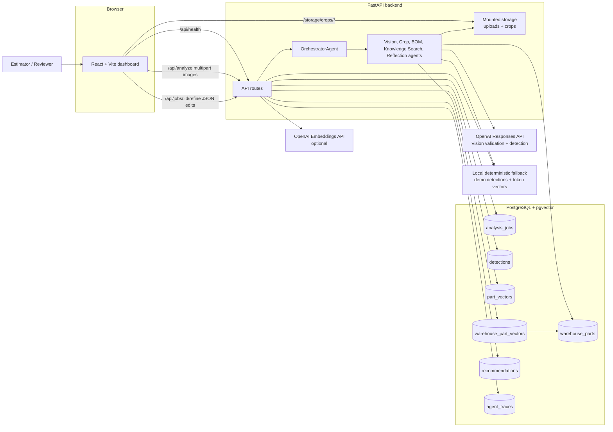
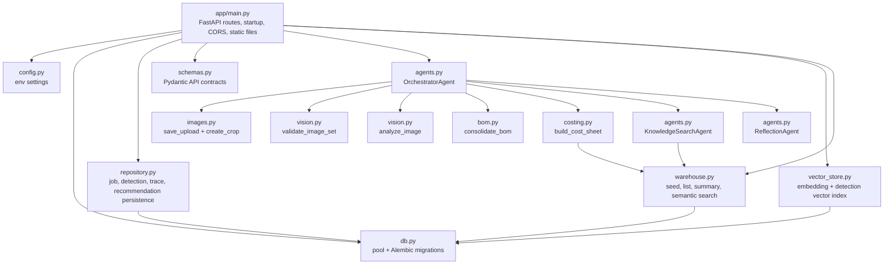
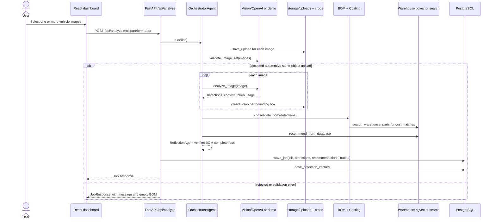
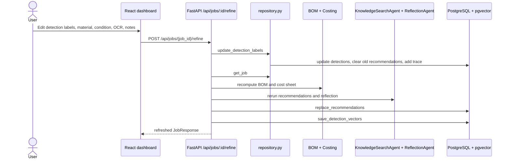
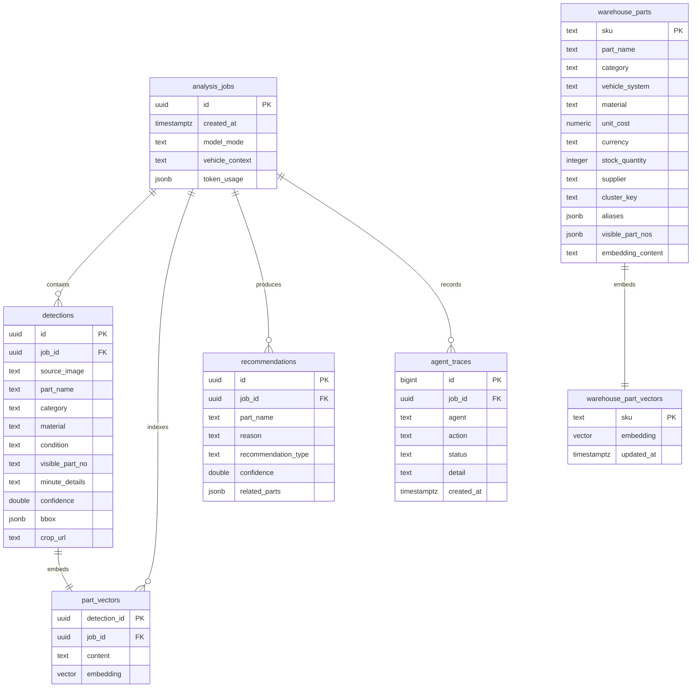

# PartIQ Vision Architecture

PartIQ Vision is a containerized full-stack prototype for vehicle image analysis, part detection, BOM consolidation, warehouse matching, costing, and human review.

## System Context



## Container Deployment

```mermaid
flowchart TB
  subgraph compose[docker-compose.yml]
    frontend[frontend<br/>Containerfile.frontend<br/>Node 23 + Vite<br/>host:5174 -> container:5173]
    backend[backend<br/>backend/Containerfile<br/>Python 3.14 + Uvicorn<br/>host:8000 -> container:8000]
    db[db<br/>pgvector/pgvector:pg17<br/>host:5433 -> container:5432]
    pgvol[(partiq_pgdata)]
    storagevol[(partiq_storage)]
  end

  frontend -->|Vite proxy /api and /storage<br/>VITE_API_PROXY_TARGET=http://backend:8000| backend
  backend -->|DATABASE_URL=postgresql://partiq:partiq@db:5432/partiq| db
  backend -->|uploads and crops| storagevol
  db --> pgvol
```

## Backend Runtime Components



## Image Analysis Flow



## Human Review And Refinement Flow



## Data Model



## API Surface

| Endpoint | Purpose |
| --- | --- |
| `GET /api/health` | Reports backend, PostgreSQL/pgvector, and OpenAI connectivity. |
| `POST /api/analyze` | Uploads images, runs the agent pipeline, persists the job, and returns detections, BOM, cost sheet, recommendations, token usage, and trace. |
| `GET /api/jobs/{job_id}` | Reloads a persisted job and recomputes BOM/cost sheet from saved detections. |
| `POST /api/jobs/{job_id}/refine` | Applies human label edits, recomputes BOM/cost sheet, reruns recommendations, and refreshes vectors. |
| `GET /api/search?q=...` | Searches previously indexed detected parts using `part_vectors`. |
| `GET /api/warehouse/summary` | Returns seeded warehouse inventory summary. |
| `GET /api/warehouse/parts` | Lists warehouse catalog rows. |
| `GET /api/warehouse/search?q=...` | Searches synthetic warehouse stock using vector and lexical matching. |
| `WS /ws/screener` | Echo-style websocket placeholder for future screening/progress workflows. |

## Key Design Notes

- The frontend uses the Vite dev server as a proxy for `/api` and `/storage`, so browser requests can stay same-origin during development and in the frontend container.
- Backend startup creates storage directories, runs Alembic migrations, opens the PostgreSQL pool, and seeds the synthetic warehouse catalog.
- OpenAI is optional. Without `OPENAI_API_KEY`, validation accepts demo uploads, vision returns deterministic demo detections, and embeddings use local token-cluster vectors.
- Uploaded originals and generated crops live in mounted storage, while normalized detections, traces, recommendations, token usage, warehouse rows, and vectors live in PostgreSQL.
- Costing is generated from BOM rows by querying the warehouse and converting USD warehouse costs to the configured display currency, INR by default.
